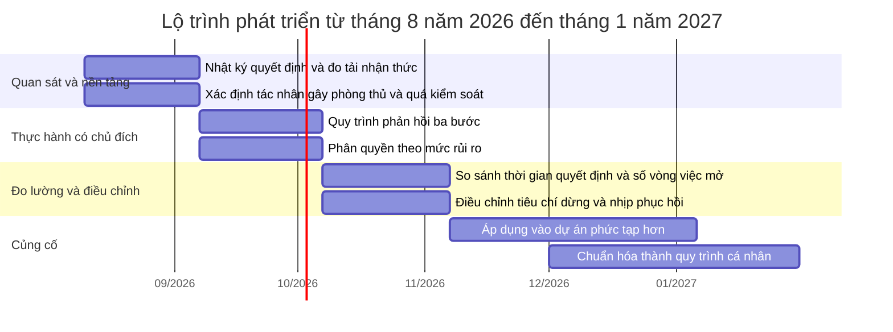

# Báo cáo nghiên cứu chuyên sâu về cấu trúc tính cách qua lá số Tử Vi

## Tóm tắt điều hành, mục tiêu và giới hạn

Báo cáo này sử dụng lá số Tử Vi trong tệp JSON làm **khung diễn giải để tạo giả thuyết về tính cách, động cơ và hành vi**, không dùng như công cụ dự đoán vận hạn, chẩn đoán tâm lý hay xác định bản chất cố định. Phạm vi dữ liệu tuân thủ yêu cầu nghiên cứu đính kèm: chỉ sử dụng lá số gốc, `_researchGuide`, tài liệu phương pháp luận bên ngoài và suy luận từ tổ hợp cung–sao; không sử dụng thông tin tự mô tả, lịch sử cuộc sống hoặc phản hồi của người quen. fileciteturn0file0

Tệp JSON đọc được đầy đủ, có đủ 12 cung, xác định rõ Mệnh tại Mùi và Thân tại Tỵ. Cấu trúc nổi bật nhất là **Mệnh vô chính diệu gặp Triệt**, được đối chiếu với Thiên Di có Thiên Đồng–Cự Môn và Hóa Kỵ; tam hợp Mệnh gồm Tài Bạch có Thái Dương–Thiên Lương–Hóa Lộc và Quan Lộc có Thái Âm–Hóa Khoa. Cung Thân an tại Phu Thê, có Thiên Cơ vượng và Văn Xương đắc địa. Trục này là nền chính của phần phân tích dưới đây. fileciteturn0file1

Do `_researchGuide` định nghĩa mức tin cậy cao là cần có bằng chứng hành vi thực tế phù hợp, trong khi nhiệm vụ này chủ động loại bỏ dữ liệu hành vi, **không nhận định nào được xếp mức “cao”**. Những kết luận có nhiều tổ hợp đồng quy được xếp “trung bình”; những kết luận phụ thuộc mạnh vào trường phái hoặc phụ tinh được xếp “thấp”.

### Các kết luận trọng tâm

| Nhận định rút gọn | Mức độ tin cậy |
|---|---|
| Bản sắc cá nhân có xu hướng được hình thành qua quá trình quan sát, thử nghiệm và điều chỉnh, hơn là dựa trên một hình ảnh bản thân đơn giản, ổn định từ sớm. | Trung bình |
| Phong cách thể hiện ra ngoài thiên về tư duy chiến lược, nhận diện mô hình, tìm phương án và cải tiến cách làm. | Trung bình |
| Nhu cầu nổi bật có thể là được nhìn nhận qua năng lực, tính hữu ích, tri thức hoặc chất lượng đầu ra hơn là qua sự phô trương đơn thuần. | Trung bình |
| Khi gặp áp lực ngắn hạn, phản ứng có thể là tăng tổ chức, tăng kiểm soát và tập trung vào giải quyết vấn đề. | Trung bình |
| Khi áp lực kéo dài, năng lực phân tích có nguy cơ chuyển thành suy nghĩ lặp lại, cảnh giác với đánh giá bên ngoài hoặc khó dừng việc tối ưu hóa. | Trung bình |
| Giao tiếp có tiềm năng sắc sảo, có cấu trúc và giàu lập luận; mặt trái là dễ giải thích quá nhiều, phòng thủ hoặc bị hiểu là tranh luận để thắng. | Trung bình |
| Có sự kết hợp giữa tính linh hoạt trí óc và tiêu chuẩn nội tại khá cứng; vì vậy có thể thay đổi phương pháp nhanh nhưng khó hạ tiêu chuẩn kết quả. | Trung bình |
| Quan hệ một–một và quá trình phản hồi từ người khác có thể đóng vai trò đáng kể trong việc kích hoạt sự trưởng thành và tự hiểu mình. | Trung bình |
| Môi trường phù hợp thường là nơi có quyền tự chủ, vấn đề đủ phức tạp, mục tiêu có ý nghĩa và tiêu chí đầu ra rõ ràng. | Trung bình |
| Môi trường giám sát vi mô, giao tiếp mơ hồ hoặc thay đổi tùy tiện có thể kích hoạt phản ứng phòng thủ, mất động lực hoặc rút lui. | Trung bình |
| Điểm mạnh nổi bật có thể gồm học nhanh, tổng hợp thông tin, tổ chức nguồn lực, xử lý tình huống phức tạp và chuyển kiến thức thành giải pháp. | Trung bình |
| Rủi ro phát triển chính là dùng quá mức chính những điểm mạnh này: phân tích quá mức, kiểm soát quá mức, tự gánh trách nhiệm và liên tục sửa hệ thống. | Trung bình |
| Ưu tiên phát triển nên là quản trị quyết định, giao tiếp khi bất đồng và thiết lập nhịp phục hồi trước khi kiệt sức. | Trung bình |

### Mục tiêu và giả thuyết nghiên cứu

Nghiên cứu có năm mục tiêu: tái dựng chính xác cấu trúc lá số; nhận diện các khuynh hướng được nhiều tổ hợp độc lập hỗ trợ; xác định yếu tố phản biện cho từng khuynh hướng; phân biệt biểu hiện trưởng thành với biểu hiện thiếu cân bằng; và chuyển các giả thuyết có độ tin cậy trung bình thành hành động phát triển có thể đo lường.

Các giả thuyết chính, về nguyên tắc có thể được kiểm tra bằng quan sát hành vi nhưng **không được kiểm chứng trong báo cáo này**, gồm:

| Mã | Giả thuyết có thể kiểm tra |
|---|---|
| H1 | Khi gặp vấn đề mới, chủ thể có xu hướng tìm mô hình, phương án và quan hệ nguyên nhân trước khi hành động. |
| H2 | Động lực tăng khi công việc cho phép thể hiện năng lực chuyên môn, tạo giá trị rõ ràng và có quyền tự chủ tương đối. |
| H3 | Áp lực ngắn hạn làm tăng tính quyết đoán và tổ chức; áp lực kéo dài làm tăng suy nghĩ lặp lại, kiểm soát hoặc rút lui. |
| H4 | Trong bất đồng, chủ thể có khả năng lập luận tốt nhưng dễ giải thích quá mức khi cảm thấy bị hiểu sai hoặc đánh giá thiếu công bằng. |
| H5 | Chất lượng quyết định cải thiện khi có thời hạn phân tích và tiêu chí dừng; suy giảm khi cố loại bỏ hoàn toàn sự không chắc chắn. |

### Giới hạn nền tảng

Tử Vi chưa được xác nhận như một phương pháp khoa học để đo lường tính cách. Các thử nghiệm thực nghiệm đối với chiêm tinh lá số nói chung không cho thấy khả năng ghép lá số với hồ sơ nhân cách vượt trội một cách đáng tin cậy; đồng thời, hiệu ứng Forer cho thấy con người có thể đánh giá các mô tả khái quát là rất đúng với riêng mình. Vì vậy, báo cáo này chỉ nên được đọc như một hệ thống giả thuyết có cấu trúc, không phải kết quả trắc nghiệm tâm lý. citeturn5view6turn1search12turn1search16

Mặt khác, nghiên cứu dân tộc học gần đây cho thấy thực hành bói toán Đông Á có thể hoạt động như một ngôn ngữ văn hóa để tổ chức trải nghiệm, đạo đức, cảm xúc và suy nghĩ. Giá trị khả dĩ của báo cáo vì thế nằm ở khả năng tạo câu hỏi tự quan sát và mở ra nhiều kịch bản diễn giải, không nằm ở tuyên bố rằng các sao trực tiếp gây ra tính cách. citeturn5view5

Các giới hạn dữ liệu cụ thể gồm: chưa biết phần mềm và phiên bản tạo lá số; chưa biết trường phái và quy tắc an sao; không có tài liệu schema chính thức cho `saoLoai` ngoài giá trị 1; chưa có nơi sinh; giờ sinh 09:00 chưa được xác nhận về nguồn và sai số; và không có bằng chứng hành vi để kiểm tra nhận định. fileciteturn0file1

## Kiểm tra dữ liệu và tái dựng lá số

### Kết quả kiểm tra cấu trúc

Tệp JSON hợp lệ, trả về `status: 200`, chứa 12 cung có chỉ số liên tục từ `cungSo: 1` đến `cungSo: 12`. Tổng cộng có 109 bản ghi sao với 109 tên sao duy nhất; không có cung đệm số 0 và không phát hiện sao trùng lặp giữa các cung. `data.diaban.cungMenh` bằng 8 và `data.diaban.cungThan` bằng 6, nhất quán với cờ `cungThan: true` tại cung số 6. Không phát hiện mâu thuẫn nghiêm trọng khiến việc xác định Mệnh hoặc Thân không thể thực hiện. fileciteturn0file1

**Mệnh:** cung số 8, địa chi Mùi, hành Thổ, vô chính diệu, có Triệt.

**Thân:** cung số 6, địa chi Tỵ, an tại cung Phu Thê, chính tinh Thiên Cơ vượng.

**Triệt:** trải trên cung số 7, Huynh Đệ tại Ngọ; và cung số 8, Mệnh tại Mùi.

**Tuần:** trải trên cung số 9, Phụ Mẫu tại Thân; và cung số 10, Phúc Đức tại Dậu.

**Tứ Hóa:** Hóa Lộc ở Tài Bạch; Hóa Quyền ở Tật Ách; Hóa Khoa ở Quan Lộc; Hóa Kỵ ở Thiên Di.

### Bảng mười hai cung

Toàn bộ dữ liệu trong bảng sau được tái dựng trực tiếp từ `data.diaban.thapNhiCung`; ký hiệu M, V, Đ, H lần lượt là Miếu, Vượng, Đắc, Hãm theo từ điển mã trong `_researchGuide`. fileciteturn0file1

| Cung | Địa chi | Chính tinh và trạng thái | Phụ tinh nổi bật dùng trong phân tích | Tứ Hóa | Tuần/Triệt | Thân và ghi chú |
|---|---|---|---|---|---|---|
| Nô Bộc | Tý | Tham Lang H | Hữu Bật, Tướng Quân, Bạch Hổ | — | — | Quan hệ nhóm có yếu tố năng động và cạnh tranh |
| Thiên Di | Sửu | Thiên Đồng H; Cự Môn H | Tấu Thư, Phúc Đức, Thiên Đức, Quả Tú, Phá Toái | Hóa Kỵ Đ | — | Đối cung Mệnh; trọng yếu khi đọc Mệnh vô chính diệu |
| Tật Ách | Dần | Vũ Khúc V; Thiên Tướng M | Tả Phù, Thiên Việt, Thiên Mã Đ, Thiên Khốc | Hóa Quyền | — | Chỉ dùng cho cơ chế áp lực và tự điều chỉnh, không luận bệnh |
| Tài Bạch | Mão | Thái Dương V; Thiên Lương V | Hỷ Thần | Hóa Lộc | — | Thuộc tam hợp Mệnh |
| Tử Tức | Thìn | Thất Sát H | Địa Kiếp H, Quốc Ấn, Hoa Cái, Thiên La | — | — | Không dùng để dự đoán con cái |
| Phu Thê | Tỵ | Thiên Cơ V | Văn Xương Đ, Linh Tinh Đ, Thiên Không, Cô Thần, Địa Giải, Kiếp Sát | — | — | **Cung an Thân**; không dùng để dự đoán hôn nhân |
| Huynh Đệ | Ngọ | Tử Vi M | Thiên Khôi, Phượng Các, Tam Thai, Thiên Quý, Địa Không H | — | Triệt | Một phía giáp cung Mệnh |
| Mệnh | Mùi | Vô chính diệu | Thiếu Âm, Đà La Đ, Hỏa Tinh H, Thiên Hình H, Phong Cáo | — | Triệt | Trục phân tích trung tâm |
| Phụ Mẫu | Thân | Phá Quân H | Lộc Tồn, Long Trì, Bát Tọa, Ân Quang | — | Tuần | Phía còn lại giáp Mệnh |
| Phúc Đức | Dậu | Vô chính diệu | Kình Dương H, Văn Khúc H, Nguyệt Đức, Đào Hoa | — | Tuần | Tham gia tam hợp của cung Thân |
| Điền Trạch | Tuất | Liêm Trinh M; Thiên Phủ V | Thanh Long, Tuế Phá, Thiên Hư, Địa Võng | — | — | Dùng thận trọng để xét nhu cầu môi trường và trật tự |
| Quan Lộc | Hợi | Thái Âm M | Thai Phụ, Văn Tinh, Thiên Tài, Hồng Loan, Thiên Quan | Hóa Khoa | — | Thuộc tam hợp Mệnh; đối cung Thân |

### Các trường được sử dụng

Các trường nền được sử dụng gồm: `cungSo`, `cungTen`, `cungChu`, `hanhCung`, `cungCan`, `cungAmDuong`, `cungThan`, `tuanTrung`, `trietLo`; cùng các trường sao `saoTen`, `saoNguHanh`, `saoAmDuong`, `saoDacTinh`, `saoPhuongVi` và `saoLoai` khi giá trị bằng 1. `saoTot` chỉ được xem như metadata của nguồn, không được dùng để kết luận tốt–xấu tuyệt đối. fileciteturn0file1

### Các trường bị loại bỏ

Không sử dụng các trường giao diện `cssSao`, `inDam`; các mã phân nhóm `saoLoai` ngoài 1; các trường ngày xem và năm xem; tuổi xem; can chi của năm 2026; `cungDaiHan`, `cungTieuHan`, `cungNguyetHan`; hoặc bất kỳ dữ liệu lưu hạn nào. Phần `supplementaryPersonalData` cũng bị bỏ qua hoàn toàn theo yêu cầu nhiệm vụ. fileciteturn0file0 fileciteturn0file1

Ngày `04/08/2026` trong trường `today` chỉ là ngày tạo hoặc ngày xem lá số và không được đưa vào luận giải. Báo cáo không phân tích vận năm 2026.

## Phương pháp luận, chiến lược nguồn và nguồn lực

### Cách tiếp cận được lựa chọn

Các thư mục sách truyền thống cho thấy Tử Vi thường được trình bày theo chuỗi: an Mệnh–Thân, phối chiếu, Mệnh–Cục, chính tinh, phụ tinh, Tuần–Triệt, Tứ Hóa, Mệnh vô chính diệu và nguyên tắc giải đoán tổng thể. Điều này hỗ trợ yêu cầu không đọc sao đơn lẻ mà đọc hệ thống quan hệ. citeturn4view0

Báo cáo áp dụng một mô hình tổng hợp có kiểm soát:

| Lớp phân tích | Cách sử dụng trong báo cáo |
|---|---|
| Mệnh | Biểu tượng cho cấu trúc bản sắc, cách tự định vị và phản ứng nền |
| Thân | Cách khuynh hướng được biểu hiện qua hành động, lựa chọn và tương tác |
| Tam hợp | Đọc Mệnh cùng Tài Bạch và Quan Lộc; đọc Thân cùng Phúc Đức và Thiên Di |
| Xung chiếu | Dùng Thiên Di để bổ sung Mệnh vô chính diệu; dùng Quan Lộc để soi đối cung Thân |
| Giáp cung | Chỉ dùng như lớp phụ trợ, không lấn át Mệnh–Thân–tam hợp |
| Tuần/Triệt | Đọc như yếu tố cản, lọc, làm chậm hoặc biến đổi biểu hiện; không mặc định hoàn toàn tốt hay xấu |
| Tứ Hóa | Đọc như bốn trọng tâm động lực: thu hút nguồn lực, quyền chủ động, năng lực được công nhận và điểm dễ vướng mắc |
| Chính–phụ tinh | Chính tinh tạo chủ đề lớn; phụ tinh chỉ điều chỉnh khi có nhiều yếu tố đồng quy |
| Miếu–Vượng–Đắc–Hãm | Sử dụng vì dữ liệu có cung cấp, nhưng giảm trọng số do chưa biết trường phái lập bảng trạng thái |
| Ngũ hành | Chỉ dùng để kiểm tra tương hỗ hoặc xung lực tổng quát, không suy diễn quá chi tiết |

Các nguồn thứ cấp mô tả ít nhất hai cách đọc lớn. Tam Hợp pháp đặt trọng tâm vào Mệnh–Tài–Quan và Thiên Di, thường “mượn” chính tinh đối cung khi một cung vô chính diệu. Một số hệ Tứ Hóa lại không mượn sao đối cung theo cùng cách, mà tập trung vào cung vị và phi hóa. Các hệ cũng có thể khác nhau về giá trị của miếu–vượng–hãm. citeturn5view0turn5view1turn5view2

Vì tệp không xác định trường phái nhưng lại chứa trạng thái sao và Tứ Hóa cố định, báo cáo lựa chọn cách đọc **gần Tam Hợp nhưng có lớp kiểm tra Tứ Hóa**. Thiên Đồng–Cự Môn ở đối cung được dùng để mô tả trường tương tác của Mệnh vô chính diệu, nhưng không bị coi như hoàn toàn tương đương với hai sao trực tiếp thủ Mệnh. Đây là lựa chọn thận trọng hơn việc gán lá số cho một môn phái chưa được xác nhận.

### Chiến lược tìm nguồn

Việc tìm tài liệu được tổ chức theo bốn tầng:

| Tầng nguồn | Ví dụ và mục đích |
|---|---|
| Sách nền có thông tin thư mục | *Tử Vi Đẩu Số Toàn Thư*, *Tử Vi Hàm Số*, *Tử Vi Tổng Hợp*, *Tử Vi Khảo Luận* |
| Tài liệu giải thích hệ phương pháp | Tam phương tứ chính, Mệnh vô chính diệu, Tứ Hóa và khác biệt trường phái |
| Công trình học thuật về bói toán như thực hành văn hóa | Dùng để định vị vai trò phản tỉnh, không xác nhận tính dự báo |
| Nghiên cứu tâm lý và kiểm định chiêm tinh | Dùng để kiểm soát hiệu ứng Barnum, thiên kiến xác nhận và ngôn ngữ tuyệt đối |

Từ khóa tiếng Việt gồm: “Mệnh vô chính diệu”, “Mệnh Thân Tử Vi”, “tam phương tứ chính”, “Tuần Triệt”, “Tứ Hóa”, “chính tinh phụ tinh”, “Tử Vi Hàm Số”, “Tử Vi Khảo Luận”. Từ khóa tiếng Anh gồm: “Zi Wei Dou Shu methodology”, “Chinese divination personality”, “astrology personality validity”, “Forer effect” và “personal validation”.

Tiêu chí đưa vào là: có tác giả hoặc thông tin thư mục; trình bày nguyên tắc tổ hợp; xác định hoặc thừa nhận trường phái; hoặc là nghiên cứu học thuật có phương pháp rõ. Bài SEO vô danh, luận giải tự động, nội dung đe dọa và các trang chỉ liệt kê ý nghĩa một sao bị loại hoặc chỉ dùng để tìm từ khóa, không dùng làm căn cứ.

*Tử Vi Hàm Số* của Nguyễn Phát Lộc được giới thiệu là tác phẩm chú trọng các khái niệm căn bản, cung, sao, Mệnh–Cục và hệ thống 14 chính tinh cùng các phụ tinh. *Tử Vi Tổng Hợp* tự đặt mục tiêu theo hướng “nhân bản”, một định hướng phù hợp với việc không dùng lá số như bản án số phận, dù đây vẫn là tài liệu truyền thống chứ không phải nghiên cứu tâm lý thực nghiệm. citeturn5view3turn5view4

### Thu thập, mã hóa và phân tích dữ liệu

Đây là **nghiên cứu tài liệu và phân tích diễn giải có cấu trúc**, không phải nghiên cứu định lượng trên người. Không có lấy mẫu người tham gia, phỏng vấn, bảng hỏi hay quan sát hành vi.

“Công cụ” phân tích là một ma trận gồm sáu trường bắt buộc cho mỗi nhận định:

1. Nhận định.
2. Căn cứ trực tiếp từ cung–sao.
3. Cơ chế diễn giải.
4. Yếu tố phản biện.
5. Các biểu hiện thay thế có thể có.
6. Mức độ tin cậy.

Các mã chủ đề được dùng gồm: bản sắc, tự chủ, công nhận, an toàn, kiểm soát, xử lý thông tin, quyết định, phản ứng áp lực, giao tiếp, gắn kết, phong cách công việc, điểm mạnh, sử dụng quá mức và tự cản trở. Việc mã hóa được thực hiện thủ công theo phương pháp so sánh liên tục: một luận điểm chỉ được giữ lại khi có ít nhất hai nguồn cấu trúc độc lập trong lá số hoặc có một tổ hợp trung tâm kèm yếu tố hỗ trợ rõ.

Không thực hiện kiểm định thống kê vì chỉ có một lá số và không có biến quan sát thực tế. Nếu các giả thuyết này được nghiên cứu khoa học trong một dự án độc lập, thiết kế hợp lý hơn sẽ là đăng ký trước giả thuyết, sử dụng thang đo tâm lý đã thẩm định, làm mù người đánh giá, có nhóm đối chứng và kiểm tra khả năng phân biệt giữa hồ sơ đúng với hồ sơ giả. Các thử nghiệm chiêm tinh trước đây cho thấy tầm quan trọng của việc dùng thiết kế mù và so sánh với xác suất ngẫu nhiên. citeturn5view6turn1search9turn1search12

### Đạo đức, rủi ro và giảm thiểu

| Rủi ro | Biện pháp giảm thiểu đã áp dụng |
|---|---|
| Mô tả Barnum, ai đọc cũng thấy đúng | Dùng căn cứ cung–sao cụ thể; nêu điều kiện kích hoạt và bằng chứng trái ngược có thể có |
| Biến khuynh hướng thành bản chất | Sử dụng ngôn ngữ giả thuyết; trình bày nhiều kịch bản biểu hiện |
| Quá phụ thuộc một sao | Yêu cầu đối chiếu Mệnh, Thân, tam hợp, đối cung, Tứ Hóa và phản tinh |
| Trộn trường phái | Ghi rõ điểm khác nhau; không sử dụng phi hóa can cung khi JSON không cung cấp đầy đủ |
| Tâng bốc hoặc gây sợ hãi | Phân tích đồng thời giá trị và chi phí của mỗi khuynh hướng |
| Khuyên hành động dựa trên mê tín | Chỉ đề xuất thói quen quản trị quyết định, giao tiếp và năng lượng có thể dùng độc lập với niềm tin Tử Vi |
| Lộ dữ liệu cá nhân | Không lặp lại tên đầy đủ trong phần luận giải; khuyến nghị ẩn danh khi chia sẻ |
| Sai số giờ sinh | Hạ mức tin cậy; không khẳng định các kết luận nhạy với vị trí Mệnh–Thân |

### Đầu ra và nguồn lực ước tính

Báo cáo hiện tại cung cấp bản kiểm tra dữ liệu, ma trận luận điểm, kế hoạch phát triển, biểu đồ tiến độ, câu hỏi phản tỉnh và danh mục nguồn.

Nếu mở rộng thành một dự án nghiên cứu phương pháp luận chuyên nghiệp, nguồn lực có thể ước tính như sau; đây là **ước tính lập kế hoạch**, không phải báo giá thị trường:

| Mức | Phạm vi | Nguồn lực | Khoảng ngân sách giả định |
|---|---|---|---|
| Thấp | Nghiên cứu bàn, tài liệu mở, một người phân tích | 20–40 giờ | 0–5 triệu đồng |
| Trung bình | Mua sách, hai người mã hóa độc lập, một chuyên gia phản biện | 60–120 giờ | 15–50 triệu đồng |
| Cao | Hội đồng nhiều trường phái, số hóa tài liệu, kiểm tra độ nhất quán liên mã hóa, biên tập học thuật | 200 giờ trở lên | 80–250 triệu đồng trở lên |

## Phân tích cấu trúc tính cách, động cơ, tư duy và hành vi

### Cấu trúc bản sắc và hình ảnh xã hội

**Nhận định:** Bản sắc cá nhân có thể mang tính “kiến tạo dần”: khó tự đóng khung bằng một nhãn đơn giản, nhưng có khả năng điều chỉnh và trưởng thành mạnh qua trải nghiệm.

**Căn cứ trực tiếp:** Mệnh tại Mùi vô chính diệu, gặp Triệt; đối cung là Thiên Di có Thiên Đồng hãm, Cự Môn hãm và Hóa Kỵ; tam hợp có hai cụm mạnh là Thái Dương–Thiên Lương–Hóa Lộc và Thái Âm miếu–Hóa Khoa. fileciteturn0file1

**Cơ chế diễn giải:** Khi Mệnh không có chính tinh trực tiếp, trọng tâm nhận diện được phân bổ sang môi trường đối diện và các cung tam hợp. Triệt làm giảm khả năng biểu hiện trực tiếp hoặc làm quá trình tự xác định phải đi qua nhiều lần kiểm tra. Trong khi đó, Dương–Lương–Lộc và Âm–Khoa tạo hai điểm tựa: giá trị, tính hữu ích, chất lượng hiểu biết và uy tín chuyên môn.

**Yếu tố phản biện:** Mệnh vẫn có Đà La, Hỏa Tinh và Thiên Hình; vì vậy đây không nhất thiết là người mềm hoặc dễ thay đổi theo người khác. Một biểu hiện khác có thể là bên ngoài ít bộc lộ nhưng bên trong có tiêu chuẩn rất cứng.

**Biểu hiện có thể có:** Khó trả lời nhanh “mình là kiểu người nào”; thay đổi cách thể hiện tùy bối cảnh; chỉ cảm thấy chắc chắn về bản thân khi có một lĩnh vực đủ hiểu sâu hoặc một kết quả đủ cụ thể.

**Mức độ tin cậy:** Trung bình.

Mệnh được giáp bởi Tử Vi miếu gặp Triệt ở Ngọ và Phá Quân hãm gặp Tuần ở Thân. Lớp giáp cung này gợi ý một căng thẳng phụ giữa **trật tự–uy tín–chuẩn mực** và **thay đổi–phá cấu trúc–tái thiết**. Vì cả hai phía đều chịu Tuần hoặc Triệt và giáp cung chỉ là lớp phụ, nhận định này có mức tin cậy thấp hơn: chủ thể có thể vừa muốn xây hệ thống ổn định, vừa định kỳ muốn loại bỏ hoàn toàn hệ thống cũ khi thấy nó không còn hợp lý. fileciteturn0file1

### Cách thể hiện ra ngoài

**Nhận định:** Khi chuyển từ nội tâm sang hành động, phong cách nổi bật có thể là quan sát nhanh, tìm quy luật, điều chỉnh chiến lược và giải quyết vấn đề bằng trí óc.

**Căn cứ:** Thân tại Tỵ, an vào Phu Thê, có Thiên Cơ vượng, Văn Xương đắc, Thiếu Dương; đối cung là Thái Âm miếu và Hóa Khoa. fileciteturn0file1

**Cơ chế:** Thiên Cơ–Xương–Khoa tạo một chuỗi biểu tượng liên quan đến xử lý thông tin, cấu trúc hóa ý tưởng, viết hoặc giải thích và cải tiến phương án. Thân tại cung quan hệ một–một cho thấy những năng lực này có thể bộc lộ rõ hơn khi có người đối thoại, khách hàng, cộng sự hoặc một đối tượng cụ thể cần được thấu hiểu.

**Phản biện:** Linh Tinh, Thiên Không, Kiếp Sát và Đại Hao tại cùng cung có thể làm tốc độ tư duy trở nên thất thường: lúc rất sáng, lúc mất hứng, đổi hướng hoặc tiêu hao quá nhiều năng lượng vào các phương án.

**Biểu hiện có thể có:** Học qua việc giải quyết vấn đề; thường nhìn thấy cách làm khác; thích đặt câu hỏi “cơ chế thật sự là gì”; có thể sửa kế hoạch giữa chừng khi nhận ra mô hình tốt hơn.

**Mức độ tin cậy:** Trung bình.

### Động cơ và nhu cầu sâu bên trong

| Động cơ giả thuyết | Căn cứ và cơ chế | Biểu hiện tích cực | Khi thiếu cân bằng | Mức tin cậy |
|---|---|---|---|---|
| **Năng lực và sự thành thạo** | Thái Âm miếu–Hóa Khoa ở Quan Lộc; Thiên Cơ–Văn Xương ở Thân | Đầu tư học sâu, thích làm việc có tiêu chuẩn, muốn hiểu bản chất | Dùng kiến thức để trì hoãn hành động hoặc bảo vệ hình ảnh “người hiểu biết” | Trung bình |
| **Tạo giá trị hữu ích** | Thái Dương–Thiên Lương–Hóa Lộc ở Tài Bạch | Muốn đầu ra có lợi ích rõ, giải quyết vấn đề thật | Khó chấp nhận hoạt động chỉ mang tính thử nghiệm hoặc chưa tạo kết quả ngay | Trung bình |
| **Quyền chủ động và kiểm soát chất lượng** | Vũ Khúc–Thiên Tướng–Hóa Quyền ở Tật Ách | Có trách nhiệm, biết tổ chức, bình tĩnh hóa tình huống phức tạp | Ôm việc, khó giao quyền, tăng kiểm soát khi bất an | Trung bình |
| **Được công nhận một cách có căn cứ** | Hóa Khoa, Hóa Lộc, Phong Cáo, Khôi–Việt và các sao hỗ trợ danh–học | Quan tâm chất lượng uy tín hơn sự nổi tiếng đơn thuần | Nhạy cảm khi công sức bị hiểu sai hoặc bị đánh giá hời hợt | Trung bình |
| **Tự do điều chỉnh phương pháp** | Thiên Cơ vượng; Mệnh vô chính diệu; ảnh hưởng Phá Quân giáp cung | Linh hoạt, tìm đường đi riêng, cải tiến quy trình | Dễ chán cấu trúc cứng hoặc thay đổi quá sớm | Trung bình |
| **Kết nối trí tuệ nhưng vẫn giữ không gian riêng** | Thân tại Phu Thê đi cùng Cô Thần; Thiên Di có Quả Tú | Ưa quan hệ có chiều sâu, tôn trọng suy nghĩ độc lập | Có thể rút lui khi đối thoại trở nên cảm tính hoặc xâm lấn | Thấp–trung bình |

Nhu cầu công nhận ở đây không nhất thiết là ham chú ý. Tổ hợp Khoa–Lộc–Dương–Lương nghiêng hơn về mong muốn “được thấy đúng giá trị” hoặc được tin cậy vì năng lực. Mặt trái là chủ thể có thể tự đặt điều kiện rằng chỉ khi làm thật tốt mới xứng đáng phát biểu, nghỉ ngơi hoặc được ghi nhận.

### Tư duy, xử lý thông tin và quyết định

Cấu trúc Thiên Cơ vượng, Văn Xương đắc, Thái Âm miếu–Hóa Khoa và Cự Môn–Hóa Kỵ tạo một kiểu tư duy có hai tầng: tầng đầu nhận diện nhanh quan hệ và phương án; tầng sau kiểm tra, chất vấn và tìm điểm chưa nhất quán. fileciteturn0file1

**Trực giác hay dữ liệu:** Có thể sử dụng trực giác về mô hình nhưng không dễ hài lòng với trực giác chưa giải thích được. Xu hướng là hình thành giả thuyết nhanh, sau đó tìm lý lẽ hoặc dữ liệu để xác nhận.

**Tổng thể hay chi tiết:** Thiên Cơ hỗ trợ nhìn hệ thống; Xương–Khoa hỗ trợ cấu trúc và chi tiết. Điểm mạnh là chuyển được giữa hai cấp độ. Điểm yếu là tiếp tục phân rã vấn đề ngay cả khi đã có đủ thông tin để hành động.

**Nhanh hay thận trọng:** Nhận diện phương án có thể nhanh, nhưng cam kết với một phương án có thể chậm hơn. Khi áp lực tăng hoặc thời hạn đến gần, Vũ Khúc–Thiên Tướng–Hóa Quyền có thể khiến quyết định đột ngột trở nên rất dứt khoát.

**Linh hoạt hay kiên định:** Linh hoạt về phương pháp nhưng tương đối kiên định về tiêu chuẩn, nguyên tắc hoặc kết quả mong muốn.

**Xử lý sự không chắc chắn:** Có khả năng sống với sự phức tạp về trí tuệ, nhưng khó chịu khi sự mơ hồ liên quan đến đánh giá xã hội, trách nhiệm hoặc nguy cơ bị hiểu sai.

Các thiên kiến có thể xuất hiện gồm:

| Thiên kiến giả thuyết | Cơ chế có thể có | Câu hỏi kiểm soát |
|---|---|---|
| Thiên kiến tối ưu hóa | Tin rằng luôn tồn tại một phương án tốt hơn nếu phân tích thêm | “Thông tin mới có thể thay đổi quyết định đến mức nào?” |
| Thiên kiến trách nhiệm | Giả định mình phải nhìn thấy và xử lý mọi rủi ro | “Phần nào thực sự thuộc trách nhiệm của tôi?” |
| Thiên kiến phòng thủ lập luận | Khi bị hiểu sai, tăng lượng giải thích thay vì kiểm tra nhu cầu đối thoại | “Người kia cần thêm dữ kiện hay cần được lắng nghe?” |
| Thiên kiến mất mát uy tín | Đánh giá sai sót như nguy cơ lớn đối với hình ảnh năng lực | “Sai số này ảnh hưởng kết quả hay chỉ ảnh hưởng cảm giác của tôi?” |
| Chi phí chìm trí tuệ | Khó bỏ một mô hình đã đầu tư nhiều công sức để xây | “Nếu bắt đầu hôm nay, tôi có tiếp tục cách này không?” |

### Phản ứng ở các cấp độ áp lực

**Trạng thái cân bằng:** Tò mò, có hệ thống, biết nhìn nhiều phương án và kết nối ý tưởng. Thiên Cơ–Xương–Khoa vận hành như năng lực học, diễn đạt và thiết kế giải pháp; Vũ–Tướng–Quyền cung cấp kỷ luật để biến ý tưởng thành hành động.

**Áp lực ngắn hạn:** Xu hướng tăng tập trung, lập thứ tự ưu tiên, cắt phần không cần thiết và giành lại quyền kiểm soát. Đây có thể là trạng thái hiệu suất cao, đặc biệt khi vấn đề có mục tiêu và giới hạn rõ.

**Áp lực kéo dài:** Cự Môn hãm–Hóa Kỵ tại Thiên Di, Văn Khúc hãm và các yếu tố Cô–Quả có thể chuyển năng lực phân tích thành tranh luận nội tâm, rà soát lời nói, cảnh giác với phản hồi hoặc thu hẹp giao tiếp. Chủ thể có thể tiếp tục làm việc nhưng giảm khả năng phục hồi.

**Khủng hoảng hoặc cảm giác mất kiểm soát:** Hỏa–Linh, Không–Kiếp, Đà La và ảnh hưởng Phá Quân có thể gợi ý một trong hai phản ứng thay thế: cứng hóa, cố kiểm soát toàn bộ; hoặc cắt bỏ, đổi hướng và rút khỏi hệ thống đột ngột. Vì phụ thuộc nhiều vào sát tinh và lớp giáp cung, nhận định cấp khủng hoảng chỉ có độ tin cậy thấp–trung bình. fileciteturn0file1

Dấu hiệu cảnh báo sớm đáng chú ý không phải là cảm xúc mạnh đơn thuần mà là: số vòng suy nghĩ tăng; sửa thông điệp nhiều lần; khó giao việc; trì hoãn quyết định vì muốn thêm dữ kiện; hoặc đột nhiên muốn hủy toàn bộ kế hoạch thay vì sửa một phần.

### Giao tiếp và quan hệ

Tấu Thư, Văn Xương, Hóa Khoa và Thiên Cơ hỗ trợ khả năng trình bày có cấu trúc. Cự Môn hãm đi cùng Hóa Kỵ ở Thiên Di lại cho thấy chính giao tiếp ngoài xã hội có thể là nơi xuất hiện nhiều ma sát nhất. fileciteturn0file1

**Cách xây lòng tin:** Có xu hướng tin người nhất quán, có năng lực, giữ lời và trao đổi minh bạch. Sự thân thiện ban đầu có thể không đủ nếu thiếu bằng chứng về chất lượng hoặc độ tin cậy.

**Cách biểu đạt nhu cầu:** Dễ biểu đạt lý do, tiêu chuẩn và vấn đề cần giải quyết hơn là nhu cầu cảm xúc trực tiếp. Người nghe có thể hiểu rõ “việc gì sai” nhưng chưa chắc hiểu “điều gì đang quan trọng về mặt cá nhân”.

**Phản ứng với bất đồng:** Ban đầu có thể phân tích và tranh luận trên nội dung. Nếu cảm thấy người kia không hiểu lập luận, xu hướng là bổ sung thêm dữ kiện hoặc siết định nghĩa. Điều này đôi khi làm cuộc trao đổi dài hơn thay vì sáng rõ hơn.

**Phản ứng với phê bình:** Phê bình cụ thể, có tiêu chí và hướng sửa có thể được tiếp nhận tốt. Phê bình mơ hồ, quy chụp hoặc thiếu công bằng có nguy cơ kích hoạt phòng thủ, im lặng hoặc phản biện rất chi tiết.

**Điểm tạo thiện cảm:** Sự hiểu biết, khả năng tìm giải pháp, tinh thần hỗ trợ thực tế, tôn trọng trí tuệ của người khác và khả năng nhìn ra điều chưa ai hệ thống hóa.

**Điểm dễ gây hiểu nhầm:** Cách đặt câu hỏi có thể bị hiểu là nghi ngờ; giải thích kỹ bị hiểu là tranh luận; giữ khoảng cách để suy nghĩ bị hiểu là lạnh nhạt; tiêu chuẩn cao bị hiểu là không hài lòng với người khác.

Thân tại cung quan hệ không có nghĩa là đời sống phải xoay quanh hôn nhân. Trong phạm vi tính cách, cách diễn giải phù hợp hơn là **các quan hệ một–một đóng vai trò như tấm gương và môi trường thực hành**: chủ thể có thể hiểu mình rõ hơn khi phải giải thích, thương lượng, hợp tác hoặc xử lý khác biệt với một người cụ thể.

### Phong cách làm việc và học tập

Mẫu hình phù hợp nhất là “tự chủ có cấu trúc”: được quyền quyết định cách làm, nhưng mục tiêu, trách nhiệm và tiêu chí hoàn thành phải rõ.

| Thành tố | Khuynh hướng có thể có |
|---|---|
| Làm việc độc lập | Tốt khi vấn đề đòi hỏi tập trung sâu và có quyền tự tổ chức |
| Làm việc nhóm | Hiệu quả khi vai trò rõ và đồng đội có năng lực; giảm hiệu quả khi trách nhiệm mơ hồ |
| Quan hệ với quy trình | Thích quy trình có lý do; có thể chống lại quy trình hình thức hoặc không còn tạo giá trị |
| Phản ứng với giám sát | Chấp nhận phản biện chuyên môn; dễ mất động lực trước giám sát vi mô hoặc thay đổi tùy hứng |
| Giải quyết vấn đề | Phân tích cơ chế, tạo mô hình, chia vấn đề thành hệ thống và tìm phương án thay thế |
| Chuyên môn hóa | Có tiềm năng học sâu, đặc biệt khi tri thức có thể chuyển thành giải pháp thực tiễn |
| Điều phối | Có khả năng khi được trao thẩm quyền tương xứng với trách nhiệm |
| Học kỹ năng mới | Tốt qua dự án thực, viết lại bằng ngôn ngữ của mình và giải thích cho người khác |
| Điều kiện tạo động lực | Vấn đề khó vừa đủ, quyền tự chủ, tác động rõ, phản hồi chất lượng |
| Điều kiện giảm động lực | Công việc lặp lại không có ý nghĩa, tiêu chí thay đổi liên tục, chính trị nội bộ và trách nhiệm không đi kèm quyền hạn |

Nguy cơ kiệt sức không nhất thiết đến từ khối lượng việc đơn thuần mà có thể đến từ **tải nhận thức mở**: quá nhiều phương án chưa đóng, quá nhiều việc “có thể cải tiến”, hoặc cảm giác phải giám sát toàn bộ chất lượng.

## Điểm mạnh, điểm yếu, mâu thuẫn và các kịch bản thay thế

### Các điểm mạnh nổi bật

| Điểm mạnh | Căn cứ và giá trị thực tế | Điều kiện phát huy | Nguy cơ dùng quá mức | Dấu hiệu dùng đúng | Mức tin cậy |
|---|---|---|---|---|---|
| **Tư duy hệ thống và chiến lược** | Thiên Cơ V, Thái Âm M–Khoa, Văn Xương Đ; giúp nhận diện mô hình và thiết kế phương án | Có vấn đề thực, đủ quyền tìm cách làm | Phân tích vô hạn, liên tục đổi mô hình | Có quyết định và sản phẩm cụ thể sau phân tích | Trung bình |
| **Khả năng học và diễn đạt tri thức** | Xương, Khoa, Văn Tinh, Tấu Thư | Được viết, giảng giải, phản biện | Dùng thuật ngữ hoặc lý lẽ thay cho giao tiếp trực tiếp | Người khác hiểu và áp dụng được | Trung bình |
| **Kỷ luật trong tình huống khó** | Vũ Khúc V–Thiên Tướng M–Hóa Quyền | Trách nhiệm và quyền hạn rõ | Ôm việc, không nhờ hỗ trợ | Hệ thống vận hành mà không phụ thuộc hoàn toàn vào cá nhân | Trung bình |
| **Khả năng tạo giá trị thực dụng** | Dương–Lương–Lộc tại Tài Bạch | Kết quả gắn với lợi ích cụ thể | Chỉ coi trọng việc đo được ngay | Vừa tạo kết quả, vừa duy trì chất lượng dài hạn | Trung bình |
| **Linh hoạt và cải tiến** | Thiên Cơ; Mệnh VCD; ảnh hưởng Phá Quân | Có không gian thử nghiệm | Đổi hướng trước khi phương án cũ được kiểm tra đủ | Thay đổi dựa trên bằng chứng và tiêu chí | Trung bình |
| **Chịu được độ phức tạp** | Nhiều tổ hợp vừa hỗ trợ vừa cản; Mệnh qua Triệt nhưng tam hợp mạnh | Có thời gian cấu trúc vấn đề | Bình thường hóa tình trạng quá tải | Biết đơn giản hóa và đóng vòng công việc | Trung bình |
| **Tiêu chuẩn đạo lý và trách nhiệm** | Thiên Lương V, Thiên Tướng M, các đức tinh hỗ trợ | Môi trường minh bạch, có ý nghĩa | Phán xét mình hoặc người khác quá nghiêm | Tiêu chuẩn được chuyển thành nguyên tắc rõ và có lòng khoan dung | Trung bình |

### Điểm yếu và mặt bóng tối

| Khuynh hướng bất lợi | Kích hoạt và căn cứ | Tác động có thể có | Điểm mạnh bị dùng quá mức | Dấu hiệu sớm | Điều chỉnh | Mức tin cậy |
|---|---|---|---|---|---|---|
| **Phân tích quá mức** | Bất định cao; Thiên Cơ–Xương–Khoa kết hợp Cự Kỵ | Chậm quyết định, hao năng lượng | Tư duy hệ thống | Mở thêm tài liệu nhưng không thay đổi lựa chọn | Đặt thời hạn và tiêu chí dừng | Trung bình |
| **Tăng kiểm soát khi lo lắng** | Trách nhiệm mơ hồ; Vũ–Tướng–Quyền | Khó giao việc, tạo áp lực cho nhóm | Kỷ luật và trách nhiệm | Kiểm tra lại việc người khác nhiều lần | Phân quyền theo mức rủi ro | Trung bình |
| **Phòng thủ bằng lý lẽ** | Bị hiểu sai hoặc phê bình mơ hồ; Cự Môn–Kỵ, Tấu Thư | Đối thoại thành tranh luận | Năng lực diễn đạt | Câu trả lời dài hơn câu hỏi | Tóm tắt cảm xúc và nhu cầu trước dữ kiện | Trung bình |
| **Phụ thuộc gián tiếp vào công nhận** | Công sức không được ghi nhận; Khoa–Lộc–Phong Cáo | Làm nhiều để chứng minh giá trị | Tiêu chuẩn chất lượng | Khó nghỉ khi đầu ra chưa “đủ đẹp” | Tách giá trị bản thân khỏi chất lượng một sản phẩm | Trung bình |
| **Rút lui hoặc cắt bỏ đột ngột** | Áp lực kéo dài, mất kiểm soát; Không–Kiếp, Hỏa–Linh, ảnh hưởng Phá Quân | Gián đoạn quan hệ hoặc dự án | Khả năng thay đổi | Muốn hủy toàn bộ thay vì sửa phần lỗi | Quy tắc chờ 24–72 giờ với quyết định khó đảo ngược | Thấp–trung bình |
| **Khó biểu đạt nhu cầu mềm** | Quan hệ cảm xúc không có cấu trúc; Cô–Quả, Thiên Cơ | Người khác chỉ thấy vấn đề, không thấy nhu cầu | Tính độc lập | Chuyển cảm xúc thành phân tích | Dùng mẫu “Tôi cảm thấy–tôi cần–tôi đề nghị” | Thấp–trung bình |
| **Không nhận ra tải nhận thức** | Nhiều vòng mở; Đại Hao, Thiên Không bên Thân | Mất hứng, phân tán, kiệt sức âm thầm | Tò mò và cải tiến | Nhiều dự án gần xong nhưng chưa đóng | Giới hạn việc đang làm và lên lịch phục hồi | Trung bình |

### Các mâu thuẫn nội tâm chính

| Cặp khuynh hướng | Hai phía và tình huống biểu hiện | Hệ quả mất cân bằng | Cách dung hòa | Mức tin cậy |
|---|---|---|---|---|
| **Linh hoạt phương pháp – cứng về tiêu chuẩn** | Thiên Cơ muốn đổi cách; Vũ–Tướng–Lương muốn đúng và có trách nhiệm | Đổi quy trình liên tục nhưng vẫn không thấy đạt chuẩn | Giữ ổn định tiêu chí, thử nghiệm phương pháp theo chu kỳ | Trung bình |
| **Muốn được công nhận – cảnh giác với đánh giá bên ngoài** | Khoa–Lộc cần giá trị được nhìn nhận; Cự Kỵ nhạy với hiểu sai | Vừa muốn phản hồi vừa phòng thủ khi nhận phản hồi | Yêu cầu tiêu chí phản hồi cụ thể trước khi thảo luận | Trung bình |
| **Muốn kết nối sâu – cần không gian tự chủ** | Thân tại cung quan hệ; Cô–Quả và Thiên Cơ cần khoảng suy nghĩ | Người khác thấy lúc gần lúc xa | Thông báo rõ nhu cầu tạm dừng và thời điểm quay lại | Trung bình |
| **Muốn xây hệ thống ổn định – muốn phá bỏ hệ thống kém hiệu quả** | Tử Vi, Thiên Phủ thiên về tổ chức; Phá Quân và Thiên Cơ thiên về tái cấu trúc | Tái thiết quá nhiều hoặc chịu đựng hệ thống lỗi quá lâu rồi cắt mạnh | Thực hiện cải tổ theo tầng: sửa, thử, đo, rồi mới bỏ | Thấp–trung bình |
| **Nhạy cảm bên trong – biểu hiện lý trí hoặc cứng rắn** | Âm–Khoa, Cự Kỵ tạo độ nhạy; Vũ–Tướng–Quyền tạo vỏ hành động | Cảm xúc không được xử lý cho đến khi quá tải | Đặt tên cảm xúc trước khi lập kế hoạch giải quyết | Trung bình |

### Các kịch bản biểu hiện thay thế

| Chủ đề | Biểu hiện trưởng thành | Biểu hiện thiếu cân bằng | Môi trường phù hợp | Môi trường không phù hợp |
|---|---|---|---|---|
| Tư duy | Phân tích đủ sâu rồi quyết định | Liên tục tìm phương án tối ưu | Có dữ liệu, thời hạn và quyền thử nghiệm | Mục tiêu thay đổi nhưng không giải thích |
| Kiểm soát | Thiết kế hệ thống và giao quyền | Giám sát mọi chi tiết | Trách nhiệm đi kèm thẩm quyền | Phải chịu trách nhiệm nhưng không có quyền |
| Giao tiếp | Lập luận rõ và kiểm tra sự hiểu nhau | Phòng thủ, giải thích dài, tranh luận ngữ nghĩa | Phản hồi cụ thể, tôn trọng | Phê bình quy chụp, chính trị nội bộ |
| Quan hệ | Gần gũi mà giữ được ranh giới | Lúc gắn kết mạnh, lúc im lặng rút lui | Người khác tôn trọng thời gian suy nghĩ | Ép phản hồi tức thì hoặc xâm lấn |
| Học tập | Học để áp dụng và truyền đạt | Thu thập kiến thức không có điểm dừng | Dự án thực, vấn đề phức tạp | Học thuộc lặp lại, không thấy ý nghĩa |
| Thay đổi | Cải tiến theo thí nghiệm | Phá bỏ khi đang thất vọng | Có phép thử nhỏ và chỉ số | Mọi thay đổi đều bị ngăn hoặc mọi thứ đều tùy tiện |

## Kế hoạch phát triển cá nhân và bộ câu hỏi tự phản tỉnh

### Ba ưu tiên phát triển

| Ưu tiên | Mục tiêu và căn cứ | Hành vi cần xây dựng | Chỉ số theo dõi | Dấu hiệu tiến bộ | Dấu hiệu cần điều chỉnh |
|---|---|---|---|---|---|
| **Quản trị quyết định** | Ngăn tư duy chiến lược chuyển thành phân tích quá mức | Phân loại quyết định đảo ngược/khó đảo ngược; đặt thời hạn; ghi tiêu chí dừng | Thời gian từ lúc đủ dữ liệu đến quyết định; số quyết định mở quá hạn | Quyết định nhanh hơn mà số lần sửa sai nghiêm trọng không tăng | Ra quyết định quá nhanh chỉ để thoát khó chịu |
| **Giao tiếp khi có ma sát** | Giảm phòng thủ và nguy cơ bị hiểu sai | Tóm tắt quan điểm người kia; hỏi một câu làm rõ; nói nhu cầu trước khi lập luận | Số cuộc trao đổi phải giải thích lại; độ dài phản hồi khi bị phê bình | Bất đồng ngắn hơn, ít vòng lặp hơn | Kìm nén quan điểm để tránh xung đột |
| **Quản trị tải nhận thức và quyền kiểm soát** | Ngăn ôm việc, mở quá nhiều vòng và kiệt sức | Giới hạn việc đang làm; phân quyền theo rủi ro; lên lịch đóng vòng và nghỉ | Số việc đang mở; số giờ làm ngoài kế hoạch; số lần kiểm tra lại việc đã giao | Ít việc mở hơn, đầu ra ổn định, phục hồi nhanh hơn | Hạ tiêu chuẩn quá mức hoặc bỏ trách nhiệm cần thiết |

### Ba thói quen nên xây dựng

**Nhật ký quyết định mười phút, năm ngày mỗi tuần.** Ghi quyết định, dữ kiện đã có, điều chưa biết, mức độ đảo ngược và thời điểm phải chốt. Sau hai tuần, kiểm tra xem dữ kiện bổ sung nào thực sự làm thay đổi lựa chọn.

**Rà soát tải nhận thức mỗi chiều thứ Sáu.** Liệt kê tất cả vòng việc đang mở; đóng, hoãn, giao hoặc loại bỏ ít nhất 20% số vòng chưa thiết yếu.

**Nghi thức phản hồi ba bước trong mọi bất đồng quan trọng.** Trước khi phản biện: diễn đạt lại ý người kia; xác nhận điểm đã hiểu; hỏi một câu làm rõ. Chỉ sau đó mới trình bày lập luận của mình.

### Ba hành vi nên hạn chế

| Hành vi | Kích hoạt | Cảnh báo sớm | Hành vi thay thế | Tự kiểm tra |
|---|---|---|---|---|
| Giải thích quá nhiều | Cảm thấy bị hiểu sai | Tin nhắn dài dần, thêm nhiều ví dụ | Tóm tắt trong ba câu và hỏi người nghe cần rõ phần nào | “Thông tin mới có giải quyết hiểu lầm hay chỉ bảo vệ tôi?” |
| Thay đổi lớn khi đang quá tải | Mất quyền kiểm soát hoặc thất vọng | Muốn hủy dự án, nghỉ, cắt quan hệ ngay | Chờ tối thiểu một chu kỳ ngủ; thử sửa một tầng nhỏ trước | “Tôi đang giải quyết cấu trúc hay đang thoát cảm giác?” |
| Giữ việc vì không tin chất lượng người khác | Sai sót hoặc trách nhiệm mơ hồ | Kiểm tra lại từng chi tiết | Giao việc với tiêu chí nghiệm thu và điểm kiểm tra rõ | “Rủi ro thật sự của sai số này là bao nhiêu?” |

### Lộ trình theo tháng

**Tháng đầu:** Chỉ quan sát, không cố sửa mọi thứ. Mục tiêu là xác định tình huống nào làm tăng phân tích, kiểm soát hoặc rút lui.

**Tháng thứ hai:** Áp dụng có chủ đích vào quyết định và bất đồng có mức rủi ro thấp trước.

**Tháng thứ ba:** So sánh số liệu tự theo dõi, giữ lại hành vi có hiệu quả và bỏ kỹ thuật tạo thêm gánh nặng.

**Tháng thứ tư đến thứ sáu:** Đưa quy trình vào các dự án phức tạp, nhưng không mở thêm mục tiêu phát triển nếu ba hành vi cốt lõi chưa ổn định.

### Bộ câu hỏi tự phản tỉnh

1. Trong ba tháng gần nhất, những quyết định nào thực sự tốt hơn nhờ phân tích thêm và những quyết định nào chỉ bị trì hoãn?
2. Tôi thường cần bao nhiêu dữ kiện trước khi có thể hành động đủ an toàn?
3. Khi nói “chưa đủ thông tin”, tôi có thể chỉ rõ thông tin nào còn thiếu không?
4. Tôi thay đổi phương án vì có bằng chứng mới hay vì cảm thấy khó chịu với sự không chắc chắn?
5. Khi chịu áp lực, tôi tăng chất lượng tổ chức hay chỉ tăng số lần kiểm tra?
6. Những việc nào tôi đang giữ lại vì rủi ro thật, và việc nào vì khó tin người khác?
7. Tôi có phân biệt rõ trách nhiệm của mình với trách nhiệm của hệ thống hoặc của người khác không?
8. Khi bị phê bình, phản ứng đầu tiên của tôi là tìm hiểu, giải thích, phản công hay rút lui?
9. Kiểu phê bình nào giúp tôi cải thiện và kiểu nào thường khiến tôi phòng thủ?
10. Khi giải thích dài, người nghe hiểu rõ hơn hay chỉ mệt hơn?
11. Tôi có thường nói rõ nhu cầu của mình hay chỉ nói điều người khác đã làm chưa đúng?
12. Tôi cần bao lâu để suy nghĩ trước khi tiếp tục một cuộc trao đổi khó?
13. Tôi có thông báo khoảng lặng đó hay để người khác tự diễn giải?
14. Tôi xây dựng lòng tin dựa trên những bằng chứng quan sát được nào?
15. Tôi có đang yêu cầu người khác đạt cùng tiêu chuẩn mà tôi tự đặt cho mình không?
16. Thành công nào của tôi đến từ tính linh hoạt và thành công nào đến từ sự kiên trì?
17. Có trường hợp nào tôi đổi hướng quá sớm trước khi phương án cũ được kiểm tra công bằng?
18. Tôi có thể chỉ ra ba dấu hiệu cho thấy một dự án đã “đủ tốt để đóng” không?
19. Bao nhiêu công việc đang mở chỉ vì tôi thấy chúng có thể được cải tiến?
20. Khi mệt, tôi có xu hướng trở nên cứng nhắc, im lặng hay tạo ra một kế hoạch mới?
21. Tôi nhận biết nhu cầu nghỉ qua tín hiệu nào trước khi hiệu suất suy giảm rõ rệt?
22. Tôi có coi nghỉ ngơi là một phần của hệ thống làm việc hay là phần thưởng sau khi hoàn hảo?
23. Điều gì khiến tôi cảm thấy năng lực của mình được nhìn nhận một cách công bằng?
24. Tôi có nhầm sự công nhận đối với một sản phẩm với giá trị tổng thể của bản thân không?
25. Môi trường nào từng giúp tôi vừa tự chủ vừa hợp tác tốt?
26. Môi trường nào làm tôi phải dành quá nhiều năng lượng để giải thích hoặc tự bảo vệ?
27. Khi một cấu trúc không hiệu quả, bước sửa nhỏ nhất có thể thử trước khi phá bỏ là gì?
28. Bằng chứng nào sẽ khiến tôi bác bỏ các giả thuyết trong báo cáo này?
29. Nhận định nào trong báo cáo có vẻ đúng chỉ vì nó đủ khái quát?
30. Sau ba tháng, hành vi quan sát được nào sẽ cho thấy kế hoạch này thực sự hữu ích?

## Phản biện nội bộ, bảng tổng hợp và nguồn khởi đầu

### Phản biện trước khi kết luận

**Nguy cơ mô tả Barnum:** Các cụm như “thông minh nhưng đôi khi suy nghĩ nhiều”, “muốn độc lập nhưng cần công nhận” rất dễ áp dụng rộng. Báo cáo đã giảm rủi ro bằng cách gắn chúng với tình huống cụ thể: bất định, phê bình mơ hồ, trách nhiệm không đi kèm quyền hạn và tải nhận thức nhiều vòng. Tuy vậy, chưa có hành vi thực tế để chứng minh tính phân biệt.

**Nguy cơ dựa quá nhiều vào Thiên Cơ:** Những nhận định về tư duy chiến lược không chỉ dựa vào Thiên Cơ mà còn dựa vào Văn Xương, Hóa Khoa, Thái Âm và trục Vũ Khúc–Thiên Tướng–Hóa Quyền. Các nhận định chỉ dựa trên phụ tinh đã được hạ mức tin cậy.

**Nguy cơ đọc Mệnh vô chính diệu theo một trường phái:** Tam Hợp pháp thường mượn sao đối cung, trong khi một số hệ Tứ Hóa không làm như vậy. Báo cáo dùng đối cung như ảnh hưởng bối cảnh, không coi Thiên Đồng–Cự Môn là hai chính tinh trực tiếp thủ Mệnh. citeturn5view0turn5view1

**Nguy cơ đơn giản hóa Tuần–Triệt:** Báo cáo không coi Triệt tại Mệnh là xấu tuyệt đối. Nó được đọc như yếu tố trì hoãn, lọc hoặc làm biểu hiện ít trực tiếp; tác động cụ thể vẫn phụ thuộc toàn tổ hợp.

**Nguy cơ diễn giải cung Tật Ách như chẩn đoán:** Cung này chỉ được dùng để xây giả thuyết về cách ứng phó áp lực. Không có kết luận sức khỏe hoặc bệnh lý.

**Nguy cơ suy diễn cung Phu Thê thành số phận quan hệ:** Thân cư Phu Thê chỉ được đọc như trọng số của tương tác một–một trong quá trình biểu hiện bản thân, không dự đoán kết hôn hoặc chất lượng hôn nhân.

**Nguy cơ lời khuyên không bắt nguồn từ lá số:** Ba ưu tiên phát triển được nối trực tiếp với ba trục có căn cứ mạnh nhất: phân tích–quyết định; giao tiếp–phòng thủ; trách nhiệm–kiểm soát. Chúng không phụ thuộc vào việc tin Tử Vi.

### Bảng tổng hợp cuối

| Nhận định | Chủ đề | Căn cứ trực tiếp | Cơ chế diễn giải | Hỗ trợ | Phản biện và cách khác | Tin cậy | Biểu hiện tích cực | Thiếu cân bằng | Hành động đề xuất |
|---|---|---|---|---|---|---|---|---|---|
| Bản sắc hình thành qua điều chỉnh | Cấu trúc tính cách | Mệnh VCD–Triệt; đối Đồng Cự Kỵ | Trọng tâm bản sắc phân bổ sang môi trường và tam hợp | Dương Lương Lộc; Âm Khoa | Có thể biểu hiện thành nội tâm cứng thay vì linh hoạt | Trung bình | Thích ứng, tự tái cấu trúc | Khó tự định vị, lệ thuộc phản hồi | Viết tiêu chí giá trị cá nhân độc lập với kết quả |
| Tư duy chiến lược | Nhận thức | Thân Thiên Cơ V, Xương Đ | Nhận diện mô hình và phương án | Âm Khoa, Thiếu Dương | Linh–Không có thể tạo phân tán | Trung bình | Học nhanh, cải tiến | Phân tích quá mức | Timebox và nhật ký quyết định |
| Động lực qua năng lực | Động cơ | Hóa Khoa Quan Lộc | Uy tín gắn với hiểu biết và chất lượng | Dương Lương Lộc | Có thể chỉ là ưu tiên làm việc, không phải nhu cầu xã hội | Trung bình | Chuyên môn sâu | Cầu toàn, chứng minh giá trị | Tách chất lượng sản phẩm khỏi giá trị bản thân |
| Tăng kiểm soát dưới áp lực | Áp lực | Vũ V–Tướng M–Quyền | Chuyển bất định thành tổ chức và quyền chủ động | Tả, Việt, Mã | Có thể biểu hiện thành quyết đoán lành mạnh | Trung bình | Bình tĩnh, tổ chức tốt | Ôm việc, giám sát vi mô | Phân quyền theo mức rủi ro |
| Giao tiếp mạnh nhưng dễ ma sát | Giao tiếp | Đồng Cự H–Kỵ ở Di; Tấu Thư | Khả năng lập luận đi cùng nhạy cảm với hiểu sai | Xương, Khoa | Đức tinh có thể làm phong cách ôn hòa hơn | Trung bình | Giải thích rõ | Phòng thủ, tranh luận dài | Quy trình phản hồi ba bước |
| Cần tự chủ có cấu trúc | Công việc | Cơ; Vũ Tướng Quyền; Dương Lương | Tự do phương pháp nhưng cần tiêu chuẩn rõ | Khoa, Lộc | Có thể làm tốt trong cấu trúc chặt nếu hợp lý | Trung bình | Chủ động, trách nhiệm | Chống quy trình, mất động lực | Thống nhất quyền hạn và tiêu chí ngay từ đầu |
| Kết nối qua chiều sâu trí tuệ | Quan hệ | Thân tại Phu Thê; Cơ–Xương | Quan hệ một–một kích hoạt tự hiểu và học hỏi | Hỷ, Địa Giải | Cô–Quả có thể làm tăng khoảng cách | Trung bình | Đối thoại sâu | Rút lui, khó nói nhu cầu mềm | Thông báo rõ nhu cầu khoảng lặng |
| Linh hoạt nhưng tiêu chuẩn cứng | Mâu thuẫn | Cơ đối Âm Khoa; Vũ Tướng Quyền | Cách làm biến đổi, tiêu chuẩn giá trị ổn định | Lương, Phủ | Có thể đơn giản là năng lực quản trị bình thường | Trung bình | Cải tiến có kỷ luật | Sửa hệ thống liên tục | Chu kỳ thử nghiệm cố định |
| Nguy cơ đổi hướng đột ngột | Tự cản trở | Hỏa–Linh–Không–Kiếp; Phá Quân giáp | Cắt bỏ để phục hồi cảm giác kiểm soát | Triệt/Tuần có thể làm chậm | Phụ thuộc nhiều phụ tinh và trường phái | Thấp–trung bình | Dám thay đổi | Hủy bỏ khi quá tải | Quy tắc chờ với quyết định khó đảo ngược |
| Cần quản lý tải nhận thức | Phát triển | Cơ, Đại Hao, Không; nhiều trục phân tích | Nhiều vòng mở tiêu hao hơn khối lượng hữu hình | Vũ Tướng giúp đóng việc | Có thể không xuất hiện nếu môi trường đơn giản | Trung bình | Xử lý nhiều biến | Kiệt sức âm thầm | Rà soát vòng mở hằng tuần |

### Tài liệu truyền thống và phương pháp luận nên bắt đầu

**Tài liệu nền tiếng Việt**

*Tử Vi Hàm Số* và *Tử Vi Tổng Hợp* của Nguyễn Phát Lộc là điểm khởi đầu phù hợp để khảo sát khái niệm cung, sao, Mệnh–Cục và cách tiếp cận nhân bản trong truyền thống Tử Vi Việt Nam. citeturn5view3turn5view4

*Tử Vi Khảo Luận* cung cấp một cấu trúc tham khảo tương đối toàn diện, với các phần riêng về Mệnh–Thân, phối chiếu, Tứ Hóa, Tuần–Triệt, Mệnh vô chính diệu, giáp cung và nguyên tắc giải đoán. Nguồn trực tuyến hiện dùng chủ yếu để xác minh mục lục; khi nghiên cứu sâu nên đối chiếu bản in đầy đủ và thông tin tác giả, ấn bản. citeturn4view0

*Tử Vi Đẩu Số Toàn Thư* là một đầu mục thư mục cổ điển thường được các hệ sau viện dẫn. Bản Google Books cho thấy nội dung bao gồm hệ thống chính tinh, phụ tinh và các mục riêng về Tuần–Triệt; cần thận trọng với vấn đề bản dịch, biên soạn và lịch sử gán tác giả. citeturn0search0turn0search2turn4view2

**Khác biệt trường phái**

Tài liệu tổng hợp về các môn phái của Học viện Lý Số hữu ích như một bản đồ thứ cấp để so sánh Tam Hợp và Tứ Hóa, đặc biệt ở cách đọc tam phương tứ chính, Mệnh vô chính diệu và miếu–vượng–hãm. Nguồn này không nên được xem như văn bản học thuật hoặc kinh điển gốc; các tuyên bố lịch sử truyền thừa cần được kiểm chứng riêng. citeturn5view0turn5view2

Các tác phẩm của Vương Đình Chi có thể được dùng để nghiên cứu cách Trung Châu phái nhấn mạnh “tinh hệ” và sự biến đổi khi các tổ hợp sao tương tác, thay vì chỉ đọc từng sao độc lập. Thông tin ấn bản tiếng Việt cần được kiểm tra theo từng bản dịch. citeturn3search0

**Nguồn học thuật và kiểm soát thiên kiến**

Carlson, Shawn, “A Double-Blind Test of Astrology,” *Nature*, 1985. Nguồn kiểm định thực nghiệm quan trọng để nhắc rằng lá số không nên được coi là công cụ đo nhân cách đã được xác nhận. citeturn5view6

Forer, Bertram R., “The Fallacy of Personal Validation,” 1949. Nguồn nền về khuynh hướng con người chấp nhận mô tả khái quát như mô tả cá nhân chính xác. citeturn1search16

Hume và Goldstein, “Is There an Association Between Astrological Data and Personality?”, 1977. Nghiên cứu không tìm thấy quan hệ có ý nghĩa giữa nhiều đặc điểm lá số và các biến nhân cách được khảo sát. citeturn1search12

Fourie, Coetzee và Costello, “Astrology and Personality: Sun-Sign or Chart?”, 1980. Nghiên cứu cho thấy độ nhất quán giữa các nhà chiêm tinh và sự tương ứng với thang 16PF thấp, củng cố yêu cầu không xem diễn giải như phép đo khách quan. citeturn1search9

Geng Li, “Reading the Heart: Cosmology, Ethics, and Language of Chinese Divination as Therapeutic Resources,” *Review of General Psychology*. Nguồn này không xác nhận tính đúng của bói toán, nhưng cung cấp khung học thuật để hiểu cách ngôn ngữ bói toán có thể tổ chức tự sự, suy nghĩ, cảm xúc và đạo đức trong bối cảnh văn hóa. citeturn5view5

Kết luận thận trọng nhất là: lá số này tạo ra một hệ giả thuyết khá nhất quán về **tư duy chiến lược, nhu cầu thành thạo, khả năng tổ chức dưới áp lực và rủi ro phân tích–kiểm soát quá mức**. Tuy nhiên, tính nhất quán nội bộ của biểu tượng không đồng nghĩa với tính đúng thực nghiệm. Giá trị thực tế của báo cáo chỉ xuất hiện khi các giả thuyết giúp người đọc quan sát hành vi rõ hơn, chấp nhận bằng chứng trái ngược và xây dựng những thói quen có lợi ngay cả khi toàn bộ khung Tử Vi bị đặt sang một bên.